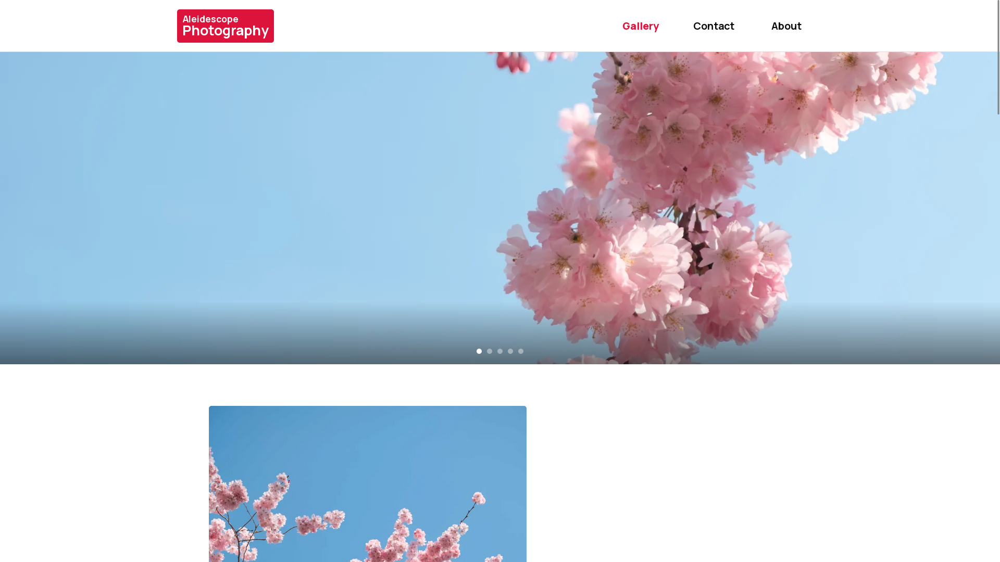
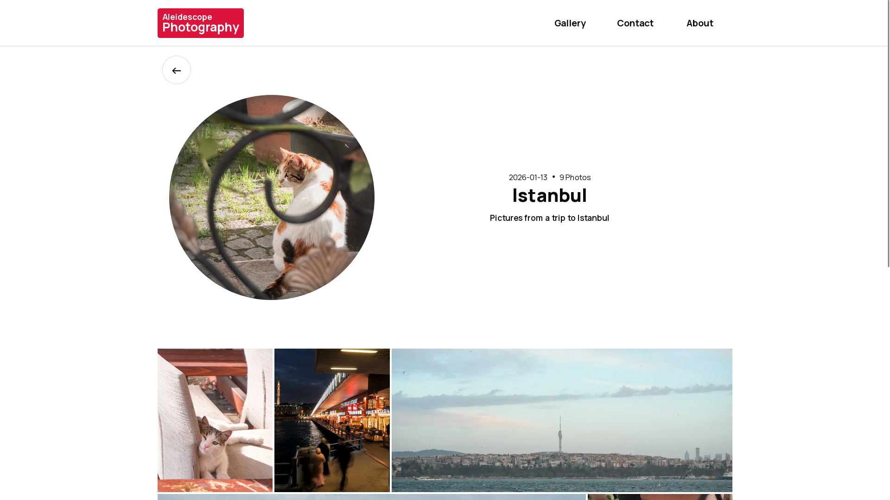
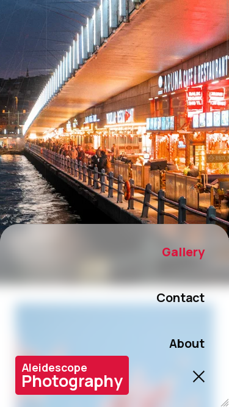

# Aleidescope Photography Portfolio
This is a website I developed as a way to share some of my photography as I felt that other platforms were too restrictive, with things such as limited aspect ratios, heavy image compression, and generally unfavourable policies. Creating my own site gives me much more freedom over how I share my photography and express myself. You can visit the site at [aleidoscope.vercel.app](https://aleidoscope.vercel.app).

# Technical
This site was developed using Next.js to leverage its image optimisation which enables lazy loading, and adaptive image serving which adjusts image quality based on display size. It also allows for the site to be deployed on Vercel with every push to the repository.

The images for the site are currently hosted on Supabase, an open source PostgreSQL database, which allows images to be easily managed and structured, while also providing an easy means of integration with its `@supabase` package.

# GUI
The GUI was designed to be simple and intuitive, keeping the focus on the photos. A strong emphasis was placed on responsiveness so the mobile experience has a varied design from the desktop version which should allow for the site to be navigated more comfortably.

*Home page*

*Gallery view*

*Mobile view*
